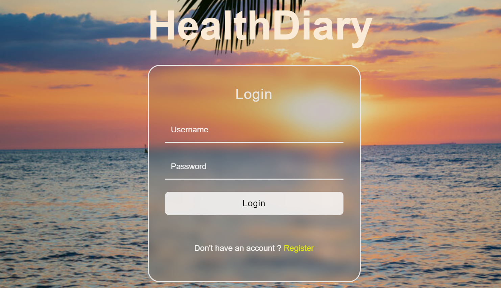
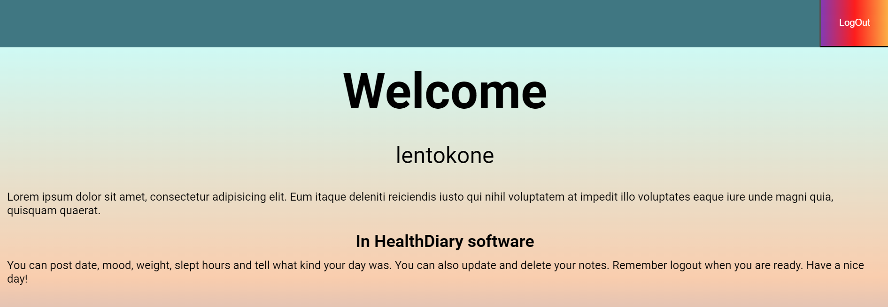
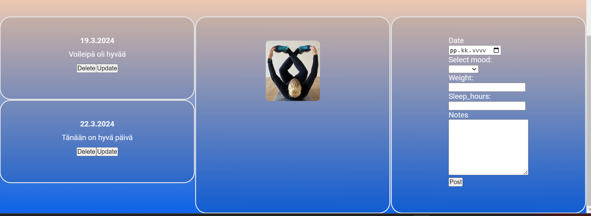

Yksilöprojekti on tehty loppukäyttäjälle, jossa käyttäjä voi rekisteröityä, kirjautua sisään, kertoa terveystietojaan sen jälkeen päivittää ja poistaa niitä.

# hyte-server back-end server
Node.Js + Express

<h3><b>Link to my frontend and the website:<b></h3>

- https://hyte-server-suvta.northeurope.cloudapp.azure.com/login.html
- https://github.com/suvitarv/html-teht-v-t/tree/main/viteprojekti/vite-project

<h3><b>/api/auth<b></h3>

  # Login
    https://hyte-server-suvta.northeurope.cloudapp.azure.com/api/auth/login
  content-type: application/json
  {
    "username": "lentokone",
    "password": "lentokone989"
  }

<h3><b>/api/users<b></h3>

  # Create user (register)
    https://hyte-server-suvta.northeurope.cloudapp.azure.com/api/users
  content-type: application/json

  {
    "username": "testikayttaja",
    "password": "testikayttaja787",
    "email": "testikayttaja@example.com"
  }

<h3><b>/api/entries<b></h3>

# Post entry
https://hyte-server-suvta.northeurope.cloudapp.azure.com/api/entries
content-type: application/json

{
  "entry_date": "2024-03-17",
  "mood": "Sad",
  "weight": .6,
  "sleep_hours": 7,
  "notes": "This was a good day"
}

# Tietojen päivitys
https://hyte-server-suvta.northeurope.cloudapp.azure.com/api/entries/${data.entry_id}

{
  "entry_date": "2024-17-03",
  "mood": "Happy",
  "weight": 80.2,
  "sleep_hours": 9,
  "notes": "This was a ok day, sleep was good though",
}

# Saa käyttäjän päivitykset
https://hyte-server-suvta.northeurope.cloudapp.azure.com/api/entries/${entry_id}
content-type: application/json

# Delete: poistaa käyttäjän päivityksen
https://hyte-server-suvta.northeurope.cloudapp.azure.com/api/entries/${entry_id}

<h3><b>Database structure<b></h3>

<h3><b>Frontend UI<b></h3>

<h3><b>Known bugs:<b></h3>

- Käyttäjälle ei tule infoa kuin consoleen että käyttäjätunnuksen luominen onnistui tai epäonnistui. Ja jos epäonnistui miksi. Kun käyttäjä on luotu pitää painaa login nappia.
- Käyttäjä ei saa myöskään tiedon lisäämisestä ja päivittämisestä erillistä ilmoitusta, mutta vieressä olevat kortit paljastavat syntyykö uusi kortti tai päivittyykö valitseman kortin tiedot.

<h3><b>Refrences:<b></h3>

- https://medium.com/@bijanrai/rsponsive-animated-login-form-in-html-css-javascript-43b55a8adedb

* Otettu tyylittelyt yllä olevalta sivulta, josta muutettu takana oleva kuva, poistettu forgot password, remember me kohdat. Muutettu rekisteröintiteksti omaksi. Käytetty vain omaa javascript koodia ja css tyylittelyitä muutettu myös oman maun mukaan. Käyty hakemassa myös tässä koodissa ollut fontti googlesta yhtenäisyyden vuoksi.

- https://www.google.com/search?sca_esv=7479081811d2e948&rlz=1C1CHBD_fiFI1081FI1083&q=sunset&tbm=isch&source=lnms&sa=X&ved=2ahUKEwj29PPzi--EAxWaLRAIHf_7A4gQ0pQJegQIEBAB&biw=1920&bih=945&dpr=1#imgrc=yujh_824yjUtmM

* Otettu taustakuva tästä osoitteesta

* Kortissa oleva kuva on omasta arkistosta

